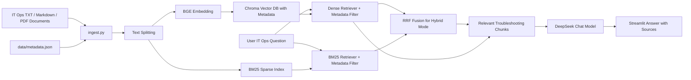

# IT Ops Knowledge Base RAG Assistant

IT Ops Knowledge Base RAG Assistant is a local enterprise-scenario RAG question-answering prototype built with LangChain, DeepSeek, Chroma, BGE Embedding, and Streamlit. It supports TXT, Markdown, and PDF documents, builds a local vector knowledge base, and answers IT operations troubleshooting questions based on retrieved context.

This project focuses on demonstrating an AI coding workflow with Codex, practical RAG application development, metadata-aware retrieval, local knowledge-base implementation, debugging, documentation, and Git branch-based iteration. It is a local runnable showcase project, not a deployed production system.

## Highlights

- IT operations knowledge base powered by LangChain RAG
- DeepSeek Chat Model integration
- BGE Embedding semantic retrieval
- Chroma local vector database
- TXT / Markdown / PDF document loading
- Metadata-aware filtering by category, system, severity, and document type
- Web-based file upload
- One-click knowledge base rebuild
- Chat history in Streamlit UI
- Adjustable retriever top-k
- Retrieved source and reference snippet display
- Retrieval evaluation baseline with Recall@K and MRR
- Optional Hybrid Retrieval with BM25 + Reciprocal Rank Fusion
- Dense / BM25 / Hybrid retrieval comparison report
- AI coding workflow with Codex + Git branches + PR-style iteration

## Demo Status

- Current version: local runnable IT ops showcase version.
- Public online demo: not deployed yet.
- The app can be run locally with the commands below.
- No public demo URL is provided until an actual deployment exists.

## Screenshots

Screenshots can be added after local UI testing.

Planned screenshot coverage:

- Streamlit IT ops chat interface
- Document upload and rebuild workflow
- Metadata filters, retrieved sources, and reference snippets

## Tech Stack

- Python
- LangChain
- langchain-classic
- DeepSeek Chat
- Chroma
- HuggingFace Embeddings
- BAAI/bge-small-zh-v1.5
- BM25
- Reciprocal Rank Fusion
- Streamlit
- pypdf
- python-dotenv
- Git

## Architecture



## Features

- Load local TXT, Markdown, and PDF files into an IT operations knowledge base
- Split documents into retrievable chunks
- Generate semantic embeddings with `BAAI/bge-small-zh-v1.5`
- Store vectors locally with Chroma
- Preserve metadata such as category, system, severity, document type, and tags
- Ask questions through a Streamlit web interface
- Upload documents from the web UI
- Rebuild the knowledge base with one click
- Keep chat history in the current Streamlit session
- Clear chat history from the sidebar
- Tune retriever `top-k` from the sidebar
- Filter retrieval by IT ops metadata fields
- Choose Dense or optional Hybrid RRF retrieval in the Streamlit sidebar
- Display retrieved source names, metadata, page information, and reference snippets
- Evaluate Dense, BM25, and Hybrid retrieval quality with a repeatable question set

## Project Structure

```text
personal-rag/
├── src/
│   ├── ingest.py        # Load raw documents, split text, build Chroma vector DB
│   ├── app.py           # Streamlit web UI for upload, rebuild, and RAG chat
│   ├── ask.py           # Command-line RAG question-answering entry point
│   ├── evaluate_retrieval.py          # V7 dense retrieval baseline
│   ├── evaluate_hybrid_retrieval.py   # V8 Dense / BM25 / Hybrid evaluation
│   └── retrieval/       # Chunk IDs, tokenizer, BM25, RRF, and hybrid retriever
├── data/raw/            # Public IT ops sample documents and local knowledge files
├── data/metadata.json   # Metadata for public IT ops sample documents
├── eval/
│   ├── questions.json   # Retrieval evaluation questions
│   └── reports/         # Generated retrieval baseline reports
├── chroma_db/           # Local generated vector database, not committed
├── .env                 # Local API key config, not committed
├── requirements.txt     # Python dependencies
└── AGENTS.md            # Project-specific Codex working rules
```

## Setup

Create and activate a virtual environment, then install dependencies:

```powershell
& 'C:\Users\14985\Desktop\personal-rag\.venv\Scripts\python.exe' -m pip install -r requirements.txt
```

Install test dependencies when running the retrieval evaluation test suite:

```powershell
& 'C:\Users\14985\Desktop\personal-rag\.venv\Scripts\python.exe' -m pip install -r requirements-dev.txt
```

Create a local `.env` file in the project root:

```env
DEEPSEEK_API_KEY=your_api_key_here
```

Do not commit `.env` to Git.

## How to Use

1. Put IT operations runbooks into `data/raw/`, or upload `.txt`, `.md`, or `.pdf` files in the Streamlit page.
2. Click `Rebuild Knowledge Base` to rebuild the local Chroma vector database.
3. Optionally select metadata filters such as category, system, severity, or document type.
4. Ask questions in the web chat or command-line interface.
5. Review retrieved sources and reference snippets under each answer.

## Commands

Build or rebuild the knowledge base:

```powershell
& 'C:\Users\14985\Desktop\personal-rag\.venv\Scripts\python.exe' src\ingest.py
```

Start command-line QA:

```powershell
& 'C:\Users\14985\Desktop\personal-rag\.venv\Scripts\python.exe' src\ask.py
```

Start the Streamlit web app:

```powershell
& 'C:\Users\14985\Desktop\personal-rag\.venv\Scripts\python.exe' -m streamlit run src\app.py
```

Run the V7 retrieval evaluation baseline:

```powershell
& 'C:\Users\14985\Desktop\personal-rag\.venv\Scripts\python.exe' src\evaluate_retrieval.py
```

Run the V8 Dense / BM25 / Hybrid retrieval comparison:

```powershell
& 'C:\Users\14985\Desktop\personal-rag\.venv\Scripts\python.exe' src\evaluate_hybrid_retrieval.py
```

Run tests:

```powershell
& 'C:\Users\14985\Desktop\personal-rag\.venv\Scripts\python.exe' -m pytest -q
```

## Retrieval Evaluation Baseline

V7 adds a repeatable retrieval-only evaluation baseline. It evaluates the current Chroma dense retriever without calling DeepSeek, so the metrics measure retrieval quality rather than answer generation quality.

Current V7 baseline result:

- Questions: 30
- Documents: 10
- Chunks: 16
- Recall@1: 86.67%
- Recall@3: 100.00%
- Recall@5: 100.00%
- MRR: 0.9278
- Zero-hit Rate: 0.00%
- Average Retrieval Latency: 9.81 ms
- P95 Retrieval Latency: 10.35 ms

Generated reports:

- `eval/reports/v7_baseline_report.md`
- `eval/reports/v7_baseline_report.json`

This baseline is intended to make future retrieval improvements measurable. V8 can compare Hybrid Retrieval against these numbers instead of relying only on subjective answer quality.

## V8 Hybrid Retrieval

V8 adds optional Hybrid Retrieval while keeping Dense retrieval as the conservative default. The implementation adds a local BM25 sparse retriever, a tokenizer for mixed Chinese and IT technical tokens, stable `chunk_id` metadata, and Reciprocal Rank Fusion (RRF).

Dense retrieval is good at semantic similarity. BM25 is better at exact lexical signals such as `df -h`, `502`, `error.log`, `max_connections`, service names, commands, and error codes. Dense scores and BM25 scores are not directly comparable, so V8 uses RRF instead of adding raw scores together.

Current V8 result:

| Mode | Recall@1 | Recall@3 | Recall@5 | MRR | Zero-hit |
|---|---:|---:|---:|---:|---:|
| Dense | 86.67% | 100.00% | 100.00% | 0.9278 | 0.00% |
| BM25 | 53.33% | 70.00% | 70.00% | 0.6167 | 30.00% |
| Hybrid RRF | 86.67% | 96.67% | 100.00% | 0.9122 | 0.00% |

Compared with Dense, Hybrid RRF had the same Recall@1, lower Recall@3, the same Recall@5, lower MRR, and one Top-1 regression. The recommendation is therefore to keep Dense as the default and expose Hybrid RRF as an optional mode for inspection.

V7 non-Top-1 query changes:

- `disk-002`: Dense rank 2 -> Hybrid rank 1. BM25 helped because the query contains `df -h` and `90%`.
- `disk-003`: Dense rank 3 -> Hybrid rank 5. The query is symptom-based and BM25 did not find the expected source.
- `nginx-005`: Dense rank 2 -> Hybrid rank 3. The query is indirect and lacks explicit `Nginx` or `502`.
- `login-005`: Dense rank 2 -> Hybrid rank 2. BM25 did not improve this short Chinese symptom query.

Generated V8 reports:

- `eval/reports/v8_hybrid_report.md`
- `eval/reports/v8_hybrid_report.json`

V8 does not add Qdrant, reranking, query rewrite, LangGraph, or an agent workflow. Those are possible later steps only if the retrieval evaluation shows a clear need.

## Example Questions

- 服务器 CPU 使用率过高应该怎么排查？
- Nginx 出现 502 Bad Gateway 怎么处理？
- MySQL 慢查询应该先看哪些信息？
- Redis 内存占用过高可能是什么原因？
- 用户登录失败应该如何定位？

## Git / Codex Workflow

This repository is also used to demonstrate an AI coding workflow:

- Use Codex to plan, implement, verify, and document changes
- Keep feature work on separate Git branches
- Run verification before committing
- Protect local secrets and generated artifacts from Git
- Keep README and project documentation aligned with the current implementation

## Security Notes

- `.env` is not committed.
- `chroma_db/` is not committed.
- `.venv/` is not committed.
- `__pycache__/` and `*.pyc` are not committed.
- Private files uploaded to `data/raw/` should not be committed to Git by default.
- Public sample IT ops files may be committed, but real company documents should stay local.

## Resume Description

基于 LangChain、DeepSeek、Chroma、BGE Embedding、BM25、RRF 和 Streamlit 开发了一个面向 IT 运维知识库的本地 RAG 问答原型，支持 TXT / Markdown / PDF 运维文档加载、网页端文件上传、一键重建知识库、metadata 过滤、Dense/Hybrid 检索模式切换、可调 top-k、聊天历史展示和回答来源追踪。项目通过 Chroma 保存本地向量库，并用 BM25 + RRF 做 Hybrid Retrieval 实验，同时建立 Recall@K、MRR、Zero-hit Rate 和检索延迟评测报告，用真实指标判断是否默认启用 Hybrid。
