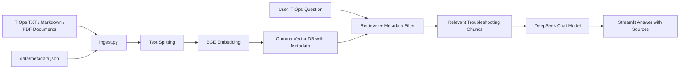

# IT Ops Knowledge Base RAG Assistant

IT Ops Knowledge Base RAG Assistant is a local enterprise-scenario RAG question-answering prototype built with LangChain, DeepSeek, Chroma, BGE Embedding, and Streamlit. It supports TXT, Markdown, and PDF documents, builds a local vector knowledge base, and answers IT operations troubleshooting questions based on retrieved context.

This project focuses on demonstrating an AI coding workflow with Codex, practical RAG application development, metadata-aware retrieval, local knowledge-base implementation, debugging, documentation, and Git branch-based iteration. It is a local runnable showcase project, not a deployed production system.

## Highlights

- IT operations knowledge base powered by LangChain RAG
- DeepSeek Chat Model integration
- BGE Embedding semantic retrieval
- Chroma local vector database
- TXT / Markdown / PDF document loading
- Metadata-aware filtering by category, system, severity, and document type
- Web-based file upload
- One-click knowledge base rebuild
- Chat history in Streamlit UI
- Adjustable retriever top-k
- Retrieved source and reference snippet display
- AI coding workflow with Codex + Git branches + PR-style iteration

## Demo Status

- Current version: local runnable IT ops showcase version.
- Public online demo: not deployed yet.
- The app can be run locally with the commands below.
- No public demo URL is provided until an actual deployment exists.

## Screenshots

Screenshots can be added after local UI testing.

Planned screenshot coverage:

- Streamlit IT ops chat interface
- Document upload and rebuild workflow
- Metadata filters, retrieved sources, and reference snippets

## Tech Stack

- Python
- LangChain
- langchain-classic
- DeepSeek Chat
- Chroma
- HuggingFace Embeddings
- BAAI/bge-small-zh-v1.5
- Streamlit
- pypdf
- python-dotenv
- Git

## Architecture



## Features

- Load local TXT, Markdown, and PDF files into an IT operations knowledge base
- Split documents into retrievable chunks
- Generate semantic embeddings with `BAAI/bge-small-zh-v1.5`
- Store vectors locally with Chroma
- Preserve metadata such as category, system, severity, document type, and tags
- Ask questions through a Streamlit web interface
- Upload documents from the web UI
- Rebuild the knowledge base with one click
- Keep chat history in the current Streamlit session
- Clear chat history from the sidebar
- Tune retriever `top-k` from the sidebar
- Filter retrieval by IT ops metadata fields
- Display retrieved source names, metadata, page information, and reference snippets

## Project Structure

```text
personal-rag/
├── src/
│   ├── ingest.py        # Load raw documents, split text, build Chroma vector DB
│   ├── app.py           # Streamlit web UI for upload, rebuild, and RAG chat
│   └── ask.py           # Command-line RAG question-answering entry point
├── data/raw/            # Public IT ops sample documents and local knowledge files
├── data/metadata.json   # Metadata for public IT ops sample documents
├── chroma_db/           # Local generated vector database, not committed
├── .env                 # Local API key config, not committed
├── requirements.txt     # Python dependencies
└── AGENTS.md            # Project-specific Codex working rules
```

## Setup

Create and activate a virtual environment, then install dependencies:

```powershell
pip install -r requirements.txt
```

Create a local `.env` file in the project root:

```env
DEEPSEEK_API_KEY=your_api_key_here
```

Do not commit `.env` to Git.

## How to Use

1. Put IT operations runbooks into `data/raw/`, or upload `.txt`, `.md`, or `.pdf` files in the Streamlit page.
2. Click `Rebuild Knowledge Base` to rebuild the local Chroma vector database.
3. Optionally select metadata filters such as category, system, severity, or document type.
4. Ask questions in the web chat or command-line interface.
5. Review retrieved sources and reference snippets under each answer.

## Commands

Build or rebuild the knowledge base:

```powershell
& 'C:\Users\14985\Desktop\personal-rag\.venv\Scripts\python.exe' src\ingest.py
```

Start command-line QA:

```powershell
& 'C:\Users\14985\Desktop\personal-rag\.venv\Scripts\python.exe' src\ask.py
```

Start the Streamlit web app:

```powershell
& 'C:\Users\14985\Desktop\personal-rag\.venv\Scripts\python.exe' -m streamlit run src\app.py
```

## Example Questions

- 服务器 CPU 使用率过高应该怎么排查？
- Nginx 出现 502 Bad Gateway 怎么处理？
- MySQL 慢查询应该先看哪些信息？
- Redis 内存占用过高可能是什么原因？
- 用户登录失败应该如何定位？

## Git / Codex Workflow

This repository is also used to demonstrate an AI coding workflow:

- Use Codex to plan, implement, verify, and document changes
- Keep feature work on separate Git branches
- Run verification before committing
- Protect local secrets and generated artifacts from Git
- Keep README and project documentation aligned with the current implementation

## Security Notes

- `.env` is not committed.
- `chroma_db/` is not committed.
- `.venv/` is not committed.
- `__pycache__/` and `*.pyc` are not committed.
- Private files uploaded to `data/raw/` should not be committed to Git by default.
- Public sample IT ops files may be committed, but real company documents should stay local.

## Resume Description

基于 LangChain、DeepSeek、Chroma、BGE Embedding 和 Streamlit 开发了一个面向 IT 运维知识库的本地 RAG 问答原型，支持 TXT / Markdown / PDF 运维文档加载、网页端文件上传、一键重建知识库、metadata 过滤、可调 top-k 语义检索、聊天历史展示和回答来源追踪。项目通过 Chroma 保存本地向量库，并使用 DeepSeek 基于检索片段生成排障回答，可用于模拟企业 IT 服务台知识库问答场景，同时展示了使用 Codex 进行 AI coding、调试、文档整理和 Git 分支迭代的完整开发流程。
